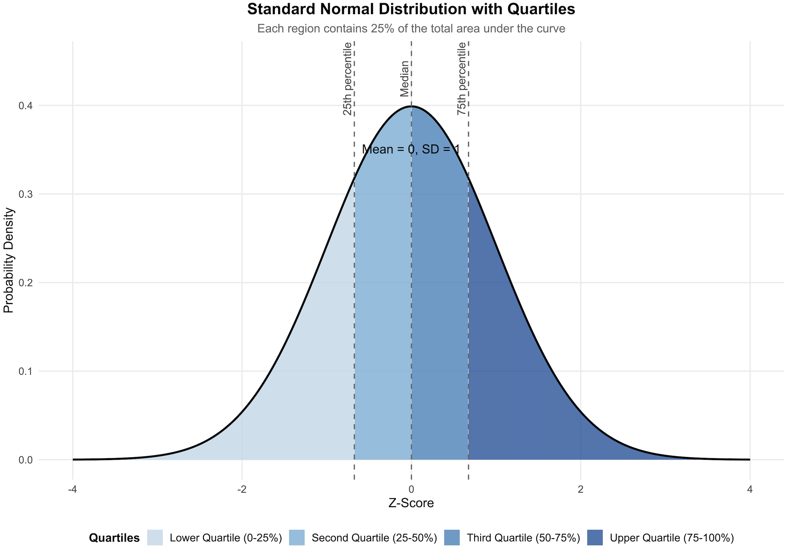

# Introduction to Statistics

Welcome! If you’ve ever wondered how we know if a new teaching method is truly effective, or if a particular therapy actually helps people, then you’ve already been thinking like a statistician. Statistics isn't just about math; it's a powerful toolkit for answering questions and understanding the world, especially in fields like education and psychology that are centered on people. This website aims to support my students at the <a href="https://uio.instructure.com/courses/59762">**RSNE4013 25H Basic concepts in Statistics course**</a>, Department of Special Needs, University of Oslo, offering an interactive environment for learning.

Haris Themistocleous

## Where You'll Use Statistics

Think of statistics not as a class you have to take, but as a practical skill you will use throughout your career. Here are a few examples of questions you'll be able to answer:

*In Education* 

*Effectiveness:* Does a new reading program actually improve student literacy scores, or is it just as good as the old one?

*Assessment:* You've created a test for your students. Is it a fair test? Do the questions accurately measure what you've taught?

*Student Support:* How can you use data on attendance and grades to identify students who might be at risk of falling behind and need extra help?

*Program Evaluation:* Your school district implements a new anti-bullying program. How can you determine with confidence whether it has reduced bullying incidents?

*In Special Needs Education and Psychology*

*Treatment Efficacy:* Does cognitive-behavioral therapy (CBT) lead to a significant reduction in anxiety symptoms compared to a placebo or another form of therapy?

*Understanding Behavior:* Is there a real relationship between the number of hours a teenager spends on social media and their self-esteem?

*Research:* You have a hypothesis that mindfulness meditation improves focus. How would you design an experiment and analyze the data to see if you're right?

*Diagnosis:* Can you use statistical analysis of patient-reported symptoms to help distinguish between different psychological disorders?

In all these cases, personal intuition or simple observation isn't enough. We need a systematic way to measure, compare, and draw meaningful conclusions. That's where statistics comes in.

## What Are Statistics?

At its core, statistics is the science of learning from data. It's a set of tools that helps us collect, analyze, interpret, and present information. Think of it as a detective's toolkit for finding clues and patterns in a sea of information.

Statistics are generally broken down into two main areas:

*Descriptive Statistics:* This is about summarizing and describing what you've found. It's how you turn a giant spreadsheet of data into something easy to understand.

*Example:* Calculating the class's average exam score (the mean), finding the most common score (the mode), or creating a graph to show the distribution of scores. You are simply describing the data you have.

*Inferential Statistics: *This is where the magic happens. It's about using data from a small group (a sample) to make educated guesses, or inferences, about a much larger group (a population).

*Example:* You can't survey every single student in a country to see if they like a new curriculum. Instead, you survey a smaller sample of, say, 1,000 students. Inferential statistics helps you determine if the results from your sample are likely to be true for the entire student population. It also tells you how certain you can be about your findings.

## Why Statistics Are So Important

Learning statistics will empower you in two fundamental ways: as a practitioner and as a consumer of information.

As a Practitioner: Answering Big Questions

Statistics gives you the tools to move from "I think this works" to "I have evidence that this works." It allows you to:

*Provide Evidence-Based Practice:* In both education and psychology, there is a huge emphasis on using practices that have been proven to be effective. Statistics is the language of that proof.

*Make Better Decisions: *Should your school invest in a new technology? Is a client responding to a particular treatment? Statistics helps you interpret the data to make an informed, objective decision.

*Conduct Your Own Research:* Whether it's for a thesis, a dissertation, or a simple project at work, statistics gives you the framework to ask questions, gather data, and find credible answers.

*As a Consumer of Information:* Becoming a Truth Detective

You are constantly bombarded with claims backed by "data." A news report says a new diet improves mood. A school board is presented with a study on the benefits of a longer school day. Statistics makes you a more critical and savvy consumer of this information. You’ll be able to ask the right questions:

Was the sample size large enough?

Were the groups being compared actually similar to begin with?

Is the reported difference meaningful in the real world, or just statistically significant?

Could there be another explanation for the results?

In short, statistics helps you separate credible findings from junk science, making you a better-informed professional and citizen. It equips you with the skepticism and skills needed to demand real evidence and understand it when you see it.